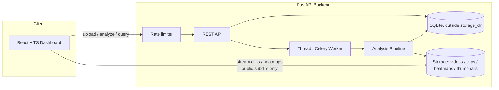
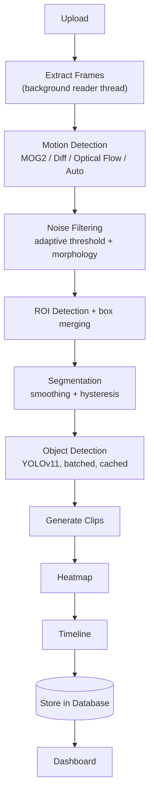

# Offline Video Segmentation & ROI Detection

An AI-powered **offline** video analytics system for recorded examination-hall
footage. It detects motion, identifies regions of interest, segments long
recordings into meaningful activity clips, runs object detection on motion
frames, and presents everything in an interactive dashboard.

> This is **not** a real-time system. Videos are processed offline, end to end.

<p align="center">
  <em>Motion detection · ROI detection · Segmentation · Object detection ·
  Heatmaps · Timelines · Event logs · Analytics · Reports</em>
</p>

For engineering depth (algorithms, trade-offs, performance, known
limitations) see [`SYSTEM_DESIGN.md`](SYSTEM_DESIGN.md). For 140 anticipated
technical questions with answers, see [`JUDGE_QA.md`](JUDGE_QA.md).

---

## ✨ Features

| # | Feature | Details |
|---|---------|---------|
| 1 | **Upload** | MP4 / AVI / MOV / MKV, validated by extension **and** content signature (magic bytes), with automatic metadata extraction. |
| 2 | **Motion detection** | Switchable algorithms: **MOG2**, **frame differencing**, **Farneback optical flow**, or **auto** (pre-scans the video and picks the best fit). Otsu-adaptive thresholding, resolution-scaled morphology. |
| 3 | **ROI detection** | Contour extraction, resolution-relative noise filtering, overlapping-box merging, a performance cap against pathologically noisy frames. |
| 4 | **Segmentation** | Temporal smoothing + hysteresis thresholding (not a single flicker-prone threshold) — auto-splits video into clips with normalized 0–1 motion scores. |
| 5 | **Object detection** | YOLOv11, batched, cached, on motion-segment frames only — phone, book (flagged heuristic, not confused with paper), bag, person, bottle, laptop. GPU with CPU fallback and OOM self-healing. Hook for custom/fine-tuned models. |
| 6 | **Heatmap** | Motion-accumulation heatmap (low/medium/high) exported as PNG. |
| 7 | **Timeline** | Motion intensity + event markers, click to jump, **drag-to-zoom**. |
| 8 | **Event logs** | Searchable, filterable, sortable, **paginated** events with ROI, objects, confidence and clip path. |
| 9 | **Dashboard** | Video player with ROI overlay, **frame-by-frame stepping**, timeline, heatmap, clip gallery, event table, statistics, **per-run performance telemetry**. |
| 10 | **Analytics** | Total events, motion duration, peak activity, average motion, objects detected, longest event — computed via SQL aggregation, not loaded-then-reduced in Python. |
| ★ | **Bonus** | PDF investigation report, CSV export, clip & heatmap downloads, ROI overlay toggle, global `/stats` dashboard overview. |

---

## 🏗️ Architecture



The AI pipeline:



See [`docs/ARCHITECTURE.md`](docs/ARCHITECTURE.md) and
[`SYSTEM_DESIGN.md`](SYSTEM_DESIGN.md) for the full breakdown.

---

## 🧱 Tech Stack

**Backend** — Python 3.12 · FastAPI · OpenCV · Ultralytics YOLOv11 · NumPy ·
FFmpeg · SQLite · SQLAlchemy · Celery/Redis (optional) · ReportLab

**Frontend** — React · TypeScript (strict) · Vite · Tailwind CSS ·
shadcn-style UI (Radix) · React Query · Recharts

**Ops** — Docker · Docker Compose · GitHub Actions

---

## 🚀 Quick Start

### Option A — Docker (recommended)

```bash
docker compose up --build
```

- Dashboard → <http://localhost:8080>
- API docs → <http://localhost:8000/docs>

Enable the optional distributed worker (Redis + Celery):

```bash
TASK_BACKEND=celery docker compose --profile celery up --build
```

### Option B — Local development

**Backend**

```bash
cd backend
python -m venv .venv && source .venv/bin/activate
pip install -r requirements.txt          # or requirements-dev.txt for tooling
cp .env.example .env
uvicorn app.main:app --reload --port 8000
```

**Frontend**

```bash
cd frontend
npm install
npm run dev        # http://localhost:5173 (proxies /api to :8000)
```

### Try it with the sample video

```bash
python scripts/generate_sample_video.py sample_data/sample_exam_hall.mp4
# then upload sample_data/sample_exam_hall.mp4 via the dashboard and click "Analyze"
```

Pre-generated sample outputs live in [`sample_data/outputs/`](sample_data/outputs)
(heatmap PNG, events CSV, PDF report).

---

## 📡 API Overview

| Method | Endpoint | Description |
|--------|----------|-------------|
| `POST` | `/api/upload` | Upload a video (extension + content-signature validated). |
| `GET` | `/api/videos` | List videos (paginated: `limit`/`offset`, `X-Total-Count` header). |
| `GET` | `/api/video/{id}` | Video detail + progress + processing stats. |
| `POST` | `/api/analyze/{id}` | Queue offline analysis (`mog2`\|`frame_diff`\|`optical_flow`\|`auto`). |
| `GET` | `/api/events/{id}` | Searchable, paginated event log. |
| `GET` | `/api/clips/{id}` | Generated clips. |
| `GET` | `/api/heatmap/{id}` | Heatmap metadata / PNG. |
| `GET` | `/api/timeline/{id}` | Motion timeline. |
| `GET` | `/api/analytics/{id}` | Aggregate analytics (SQL-side). |
| `GET` | `/api/stats` | Aggregate stats across all videos (dashboard overview). |
| `GET` | `/api/report/{id}/csv` · `/pdf` | Export report. |
| `DELETE` | `/api/video/{id}` | Delete a video and all artefacts. |

Rate-limited (best-effort, single-process): `/upload` and `/analyze/*` have
their own stricter per-minute budgets. Full reference:
[`docs/API.md`](docs/API.md) · interactive docs at `/docs`.

---

## 🧪 Testing

```bash
cd backend
pip install -r requirements-dev.txt
pytest --cov=app           # 143 unit / integration / API / security tests

cd ../frontend
npm run build              # strict TypeScript type-check + production build
```

---

## 📚 Documentation

- [System design](SYSTEM_DESIGN.md) — architecture, algorithms, trade-offs, limitations
- [Judge Q&A](JUDGE_QA.md) — 140 anticipated technical questions, answered
- [Installation guide](docs/INSTALLATION.md)
- [Docker setup](docs/DOCKER.md)
- [Architecture](docs/ARCHITECTURE.md)
- [API reference](docs/API.md)
- [Developer guide](docs/DEVELOPER_GUIDE.md)
- [Deployment guide](docs/DEPLOYMENT.md)

---

## ⚙️ Performance Notes

- **1080p / 3-hour+ recordings**: a background frame-reader thread overlaps
  video decode with CV processing via a bounded queue (caps memory growth);
  the pipeline decodes once for motion analysis and only seeks to a handful
  of representative frames per segment for object detection, clips and
  thumbnails. Tune `FRAME_SAMPLE_STEP` to trade speed for temporal resolution.
- **GPU acceleration**: YOLO runs on CUDA automatically when available
  (`YOLO_DEVICE=auto`), falls back to CPU, and self-heals (retries on CPU)
  on a CUDA out-of-memory error rather than silently dropping detections.
- **Graceful degradation**: missing FFmpeg, missing YOLO weights/`ultralytics`,
  a handful of corrupt frames, or a GPU going unavailable mid-run all degrade
  gracefully — the pipeline never crashes the whole analysis over a partial
  failure. See [`SYSTEM_DESIGN.md`](SYSTEM_DESIGN.md) for the full list.

## 🔒 Security Notes

- Uploads are validated by extension **and** a magic-byte content-signature
  check (not just the claimed filename).
- The SQLite database lives outside any publicly-served directory; only
  specific artefact subdirectories (`videos/`, `clips/`, `heatmaps/`,
  `thumbnails/`) are mounted, never the storage root.
- Best-effort in-process rate limiting on `/upload` and `/analyze/*`.
- **No authentication** — this is a documented, deliberate scope boundary
  (see `SYSTEM_DESIGN.md` → Known Limitations), not an oversight. Deploy
  behind a trusted network boundary before exposing publicly.

---

## 📁 Project Structure

```
backend/    FastAPI app, AI pipeline, services, models, tests
frontend/   React + TypeScript dashboard
storage/    videos / clips / heatmaps / thumbnails (generated, publicly served)
data/       SQLite database (generated, NOT publicly served)
scripts/    sample-data generator
sample_data/ sample video + pre-generated outputs
docs/       installation, docker, architecture, API, developer, deployment
```

## 📄 License

MIT — see [`LICENSE`](LICENSE).
