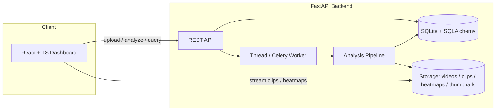
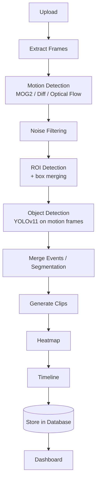

# Offline Video Segmentation & ROI Detection

An AI-powered **offline** video analytics system for recorded examination-hall
footage. It detects motion, identifies regions of interest, segments long
recordings into meaningful activity clips, runs object detection on motion
frames, and presents everything in an interactive dashboard.

> This is **not** a real-time system. Videos are processed offline, end to end.

<p align="center">
  <em>Motion detection · ROI detection · Segmentation · Object detection ·
  Heatmaps · Timelines · Event logs · Analytics · Reports</em>
</p>

---

## ✨ Features

| # | Feature | Details |
|---|---------|---------|
| 1 | **Upload** | MP4 / AVI / MOV / MKV with automatic metadata extraction (fps, duration, resolution). |
| 2 | **Motion detection** | Switchable algorithms: **MOG2** background subtraction, **frame differencing**, **Farneback optical flow**. |
| 3 | **ROI detection** | Contour extraction, tiny-motion & noise filtering, overlapping-box merging. |
| 4 | **Segmentation** | Auto-splits video into clips at motion start/stop with start/end/duration/thumbnail/score. |
| 5 | **Object detection** | YOLOv11 on motion frames only — phone, paper/book, bag, person, bottle, laptop. Prohibited items flagged. |
| 6 | **Heatmap** | Motion-accumulation heatmap (low/medium/high) exported as PNG. |
| 7 | **Timeline** | Motion intensity + object + event markers; click to jump to any timestamp. |
| 8 | **Event logs** | Searchable, filterable, sortable events with ROI, objects, confidence and clip path. |
| 9 | **Dashboard** | Video player with ROI overlay, timeline, heatmap, clip gallery, event table, statistics. |
| 10 | **Analytics** | Total events, motion duration, peak activity, average motion, objects detected, longest event. |
| ★ | **Bonus** | PDF investigation report, CSV export, clip & heatmap downloads, ROI overlay toggle. |

---

## 🏗️ Architecture



The AI pipeline:



See [`docs/ARCHITECTURE.md`](docs/ARCHITECTURE.md) for the full breakdown.

---

## 🧱 Tech Stack

**Backend** — Python 3.12 · FastAPI · OpenCV · Ultralytics YOLOv11 · NumPy ·
FFmpeg · SQLite · SQLAlchemy · Celery/Redis (optional) · ReportLab

**Frontend** — React · TypeScript · Vite · Tailwind CSS · shadcn-style UI
(Radix) · React Query · Recharts

**Ops** — Docker · Docker Compose · GitHub Actions

---

## 🚀 Quick Start

### Option A — Docker (recommended)

```bash
docker compose up --build
```

- Dashboard → <http://localhost:8080>
- API docs → <http://localhost:8000/docs>

Enable the optional distributed worker (Redis + Celery):

```bash
TASK_BACKEND=celery docker compose --profile celery up --build
```

### Option B — Local development

**Backend**

```bash
cd backend
python -m venv .venv && source .venv/bin/activate
pip install -r requirements.txt          # or requirements-dev.txt for tooling
cp .env.example .env
uvicorn app.main:app --reload --port 8000
```

**Frontend**

```bash
cd frontend
npm install
npm run dev        # http://localhost:5173 (proxies /api to :8000)
```

### Try it with the sample video

```bash
python scripts/generate_sample_video.py sample_data/sample_exam_hall.mp4
# then upload sample_data/sample_exam_hall.mp4 via the dashboard and click "Analyze"
```

Pre-generated sample outputs live in [`sample_data/outputs/`](sample_data/outputs)
(heatmap PNG, events CSV, PDF report).

---

## 📡 API Overview

| Method | Endpoint | Description |
|--------|----------|-------------|
| `POST` | `/api/upload` | Upload a video. |
| `GET` | `/api/videos` | List videos. |
| `GET` | `/api/video/{id}` | Video detail + progress. |
| `POST` | `/api/analyze/{id}` | Queue offline analysis. |
| `GET` | `/api/events/{id}` | Searchable event log. |
| `GET` | `/api/clips/{id}` | Generated clips. |
| `GET` | `/api/heatmap/{id}` | Heatmap metadata / PNG. |
| `GET` | `/api/timeline/{id}` | Motion timeline. |
| `GET` | `/api/analytics/{id}` | Aggregate analytics. |
| `GET` | `/api/report/{id}/csv` · `/pdf` | Export report. |
| `DELETE` | `/api/video/{id}` | Delete a video and all artefacts. |

Full reference: [`docs/API.md`](docs/API.md) · interactive docs at `/docs`.

---

## 🧪 Testing

```bash
cd backend
pip install -r requirements-dev.txt
pytest --cov=app           # 28 unit / integration / API tests

cd ../frontend
npm run build              # strict TypeScript type-check + production build
```

---

## 📚 Documentation

- [Installation guide](docs/INSTALLATION.md)
- [Docker setup](docs/DOCKER.md)
- [Architecture](docs/ARCHITECTURE.md)
- [API reference](docs/API.md)
- [Developer guide](docs/DEVELOPER_GUIDE.md)
- [Deployment guide](docs/DEPLOYMENT.md)

---

## ⚙️ Performance Notes

- **1080p / 2-hour recordings**: the pipeline decodes the video once for motion
  analysis and only seeks to a handful of representative frames per segment for
  object detection, clips and thumbnails. Tune `FRAME_SAMPLE_STEP` to trade
  speed for temporal resolution.
- **GPU acceleration**: YOLO runs on CUDA automatically when available
  (`YOLO_DEVICE=auto`), falling back to CPU.
- **Graceful degradation**: if YOLO weights / `ultralytics` are unavailable
  (e.g. fully offline CI), object detection disables itself and the rest of the
  pipeline continues.

---

## 📁 Project Structure

```
backend/    FastAPI app, AI pipeline, services, models, tests
frontend/   React + TypeScript dashboard
storage/    videos / clips / heatmaps / thumbnails (generated)
scripts/    sample-data generator
sample_data/ sample video + pre-generated outputs
docs/       installation, docker, architecture, API, developer, deployment
```

## 📄 License

MIT — see [`LICENSE`](LICENSE).
