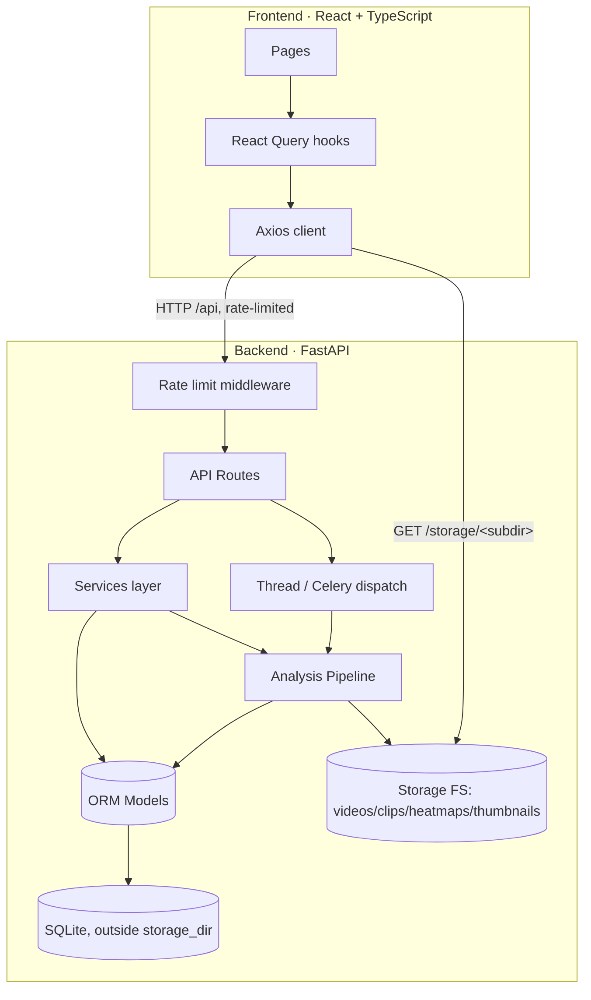
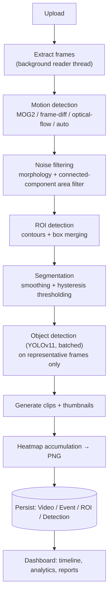
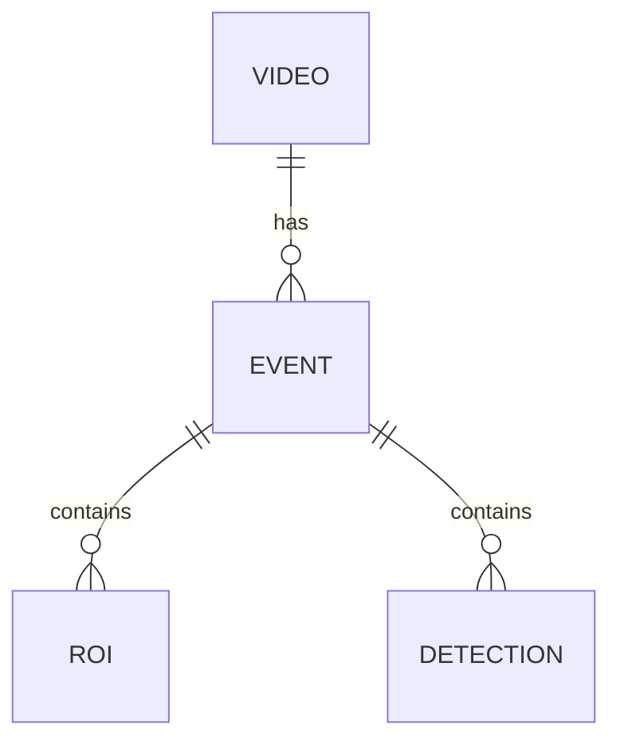

# System Design

This document explains the architecture, algorithms, trade-offs, performance
characteristics, known limitations and future roadmap of the Offline Video
Segmentation & ROI Detection system, for engineers and judges evaluating the
project in depth. For a lighter overview see [`README.md`](README.md); for
100+ anticipated questions with answers see [`JUDGE_QA.md`](JUDGE_QA.md).

---

## 1. Problem framing

Examination-hall (or similar surveillance) recordings run for hours and are
almost entirely static. A human reviewer scrubbing through raw footage to
find the handful of minutes that actually matter is slow and error-prone.
The system's job is to do that triage automatically and **offline**: given a
video file, produce a ranked, searchable list of "things happened here"
moments, each with a bounding region, an object-detection hypothesis, a clip,
and a confidence/intensity score — plus aggregate statistics and a heatmap
for a bird's-eye view of the whole recording.

"Offline" is a real design constraint, not just a mode: there is no
frame-rate deadline, no live-stream backpressure, no need to run YOLO on
every single frame. The entire pipeline is designed around **one full decode
pass for motion analysis** and **a light second pass that only touches a
handful of representative frames** for the expensive parts (object detection,
clip cutting, thumbnails).

---

## 2. Architecture



**Layering** (`backend/app/`):

```
api/        Thin HTTP layer — routes + FastAPI dependencies. No business logic.
services/   Business logic + the AI pipeline (motion, ROI, segmentation, YOLO,
            heatmap, analytics, video CRUD, reports).
models/     SQLAlchemy ORM: Video, Event, ROI, Detection.
schemas/    Pydantic request/response contracts (mirrored 1:1 by frontend TS types).
database/   Engine, session factory, declarative base.
workers/    Thread runner (default) + optional Celery app.
core/       Config (pydantic-settings, validated), structured logging, rate limiter.
utils/      Geometry (IoU/box-merge), video I/O, filesystem, upload-content validation.
```

This is a fairly conventional layered/clean architecture. The one
non-obvious design decision worth calling out: **the motion-algorithm
"Strategy" pattern**. `MotionDetector` exposes one `process(frame) ->
MotionResult` interface regardless of which of the three concrete algorithms
(MOG2 / frame differencing / optical flow) is selected, and a fourth
pseudo-mode (`auto`) resolves to one of the three *before* a `MotionDetector`
is even constructed (`select_best_algorithm()`). This keeps the pipeline
orchestration code algorithm-agnostic and makes adding a fourth real
algorithm a localized change.

---

## 3. The analysis pipeline



### 3.1 Frame extraction (background reader thread)

A dedicated thread (`_FrameReaderThread`) decodes the video sequentially and
pushes only the sampled frames (every `frame_sample_step`th) onto a **bounded**
queue. The main thread pulls from that queue and runs CV processing. This
overlaps decode I/O with CV compute — OpenCV's C++ core releases the GIL for
both `VideoCapture.read()` and the per-frame CV operations, so this achieves
genuine wall-clock parallelism despite Python's interpreter lock. The queue
bound (`frame_buffer_size`, default 64) is the concrete safeguard against
unbounded memory growth if CV processing falls behind decoding on a very long
recording.

### 3.2 Motion detection

Three real algorithms, selectable per run, or `auto`:

| Algorithm | How it works | Best for | Weakness |
|---|---|---|---|
| **MOG2** | Adaptive Gaussian-mixture background model (`cv2.createBackgroundSubtractorMOG2`); a pixel is foreground if it doesn't fit the learned background distribution. | Gradual lighting change (sun moving, dimmer/brighter over hours). | Slow to adapt to sudden lighting jumps; needs a short warm-up. |
| **Frame differencing** | Absolute pixel difference between consecutive grayscale frames, thresholded. | Stable lighting, cheap compute. | No memory — a stationary object that stops moving "disappears" instantly, and any lighting flicker reads as motion everywhere. |
| **Optical flow (Farneback)** | Dense per-pixel motion vector field between two frames; magnitude thresholded. | Distinguishing true directional movement from noise/flicker in busy/textured scenes. | Most expensive of the three; sensitive to its own set of tuning parameters (window size, pyramid levels). |
| **Auto** | Pre-scans ~40 evenly-strided frames, measures illumination stability (stddev of mean brightness) and inter-frame noise (median pixel delta), and picks MOG2 / frame-diff / optical-flow by simple thresholds on those two signals. | "I don't know my footage's characteristics." | A heuristic, not a learned classifier — see §7. |

Every algorithm's raw foreground mask is then:

1. **Otsu-adaptively thresholded** (when `adaptive_threshold=True`, the
   default) instead of using one fixed cutoff constant for every frame —
   the cutoff adapts to that frame's actual bimodal foreground/background
   split, with a floor to prevent Otsu from calling ordinary sensor noise
   "motion" on a near-static frame.
2. **Morphologically cleaned** (open + dilate) with a kernel sized
   proportionally to the frame's resolution (diagonal / 400, odd-ized) — a
   fixed 5×5 kernel over-smooths 480p and under-cleans 4K.
3. **Connected-component area filtered**: any blob smaller than `min_area`
   (fixed pixels) or `min_area_fraction` (resolution-relative, preferred) is
   zeroed out of the mask entirely — this is what makes the *motion score*
   itself noise-robust, not just the downstream ROI boxes (see §8.1 for why
   this used to be a real bug).

MOG2 specifically also reports `is_warming_up` for its first 15 frames (its
background model needs a few frames of history before it's meaningful); the
pipeline treats warm-up frames as unable to *start* a segment, avoiding a
spurious motion spike at t=0.

### 3.3 ROI (region of interest) detection

`cv2.findContours` on the cleaned mask → filter by area (resolution-relative
when configured) → merge overlapping boxes by IoU (`merge_boxes`, a greedy
repeated-merge until no pair exceeds the IoU threshold) → cap the result at
`max_boxes` (largest kept). A performance guard (`max_raw_contours`) caps how
many raw contours are considered *before* the O(n²) merge pass runs, bounding
worst-case per-frame cost on a pathologically noisy frame.

### 3.4 Segmentation (event generation)

This is the step that turns a per-frame score timeline into a handful of
labeled "events," and it's the one most prone to naive-implementation bugs
(fragmentation, false starts). The pipeline applies three textbook
signal-processing techniques in sequence:

1. **Temporal smoothing** — a trailing moving average (`smooth_scores`,
   vectorized with `np.convolve`) damps single-frame score spikes/dropouts
   before any threshold decision is made.
2. **Hysteresis thresholding** — two thresholds, not one: a higher
   `enter_threshold` to *start* a segment (and only when at least one ROI box
   is present that frame — a raw score spike with zero detected regions
   can't start an event) and a lower `exit_threshold` (default 60% of enter)
   to *end* it. A score dithering around a single boundary would otherwise
   flicker active/inactive many times per second and fragment one real event
   into dozens of spurious tiny ones — hysteresis is the standard fix (the
   same technique Canny edge detection uses for its double threshold).
3. **Gap bridging + minimum duration** — short inactive gaps
   (`segment_merge_gap_sec`) inside a burst are bridged into one segment
   without inflating its reported end time into the quiet tail; segments
   shorter than `min_segment_duration_sec` are dropped as residual noise.

**Score normalization**: alongside the raw (algorithm-dependent, typically
tiny — e.g. 0.02) score used for threshold decisions, each segment also
carries a **video-relative min-max normalized** score (0..1, where 1.0 means
"the most active moment in this recording"). This is what's actually stored
as `Event.motion_score` / `peak_motion_score` and shown on the dashboard —
raw pixel-fraction scores are not very legible to a human, and normalizing
against the video's own observed range makes them so, without touching the
raw values that drive the segmentation decision itself (avoiding a circular
dependency where the display transform would influence the threshold logic).

### 3.5 Object detection (YOLOv11)

Runs **only on frames belonging to a detected motion segment** — never on
the full video — and even then, only on up to three representative frames
per segment (start / peak-motion / end), batched into a single
`model.predict(list_of_frames, ...)` call rather than three sequential
single-frame calls. See §5 for the full detail (label mapping, caching, GPU
handling).

### 3.6 Clip / thumbnail / heatmap generation

- **Clips**: FFmpeg (`libx264`, `veryfast` preset) cuts `[start, end]` per
  event; falls back to an OpenCV frame-by-frame re-encode if FFmpeg isn't on
  `PATH` (still correct, just slower — see §7).
- **Thumbnails**: a single representative frame (peak-motion time),
  downscaled.
- **Heatmap**: every processed frame's motion mask is summed into a
  `float32` accumulator (fixed memory = frame resolution, independent of
  video duration); at the end it's gamma-boosted, blurred, JET-colormapped
  and alpha-blended over a representative background frame, then written as
  PNG.

### 3.7 Persistence

`Video` → many `Event` → many `ROI` / `Detection`, in SQLite by default (see
§6 for schema detail). `Video.processing_stats` stores a JSON blob of
per-run performance telemetry (throughput, resolved algorithm, cache hit
rate, per-stage timings) surfaced on the dashboard's Performance tab.

---

## 4. Trade-offs (and why)

| Decision | Alternative considered | Why this way |
|---|---|---|
| One full decode pass for motion, light second pass for the rest | Two full decode passes (one for motion, one for object detection at every frame) | Roughly halves total wall-clock time on long videos; object detection is only useful on the frames that already show motion. |
| Thread-based background worker by default, Celery optional | Celery-always | Zero external dependencies (no Redis) for the common single-node/demo case; the exact same `run_analysis()` function backs both paths, so nothing is duplicated. |
| SQLite by default | Postgres-always | Zero-setup for a hackathon demo; `DATABASE_URL` is a one-line change to Postgres for production scale (see `docs/DEPLOYMENT.md`). |
| In-process rate limiter | Redis-backed distributed limiter | No new infra dependency for the default deployment; explicitly documented as not multi-worker-safe (§7) rather than silently pretending it is. |
| Heuristic `auto` algorithm selection | A trained classifier over video features | A trained classifier needs labeled training data this project doesn't have; the heuristic is transparent, fast (one small pre-scan), and its reasoning is logged, which matters for a system a human has to trust. |
| "book" reported honestly, not relabelled to "paper" | Keep the old (incorrect) relabelling for a nicer demo | Overclaiming detection capability is a worse failure mode than an honest "book" label with a documented caveat — a judge asking "does this detect chits?" deserves an accurate answer, not a good-looking lie. |

---

## 5. Object detection: capability and honesty

YOLOv11 (`yolo11n.pt` by default, COCO-pretrained) is filtered down to a
curated label set relevant to exam-hall monitoring: `phone`, `book`, `bag`
(backpack/handbag/suitcase merged), `person`, `bottle`, `laptop`.

**The load-bearing limitation**: COCO has no class for loose paper, folded
notes, or hand-written chits — the actual thing an invigilator most wants
detected. `book` is the closest visual proxy, and every detection of it is
tagged `heuristic: true` and reported as "book," never silently renamed to
something it isn't. The frontend renders heuristic detections with a dashed
border and a "possible" label prefix instead of treating them the same as a
confident `phone` detection.

**The extension point**: `ObjectDetector` accepts `custom_model_path` /
`custom_label_map_path` (or the equivalent `CUSTOM_YOLO_MODEL_PATH` /
`CUSTOM_LABEL_MAP_PATH` settings). A label-map JSON lets a fine-tuned model's
own class names be mapped to normalized labels and marked prohibited,
independently of the built-in defaults:

```json
{
  "class_map": {"chit": "paper_note", "smartwatch": "watch"},
  "prohibited_labels": ["paper_note", "phone", "watch"],
  "relevant_labels": ["paper_note", "phone", "watch", "person"]
}
```

Fine-tuning recipe (future work, not shipped): collect exam-hall footage
with loose paper/chits visible, annotate with a tool like CVAT or
Roboflow, fine-tune `yolo11n.pt` with Ultralytics' training CLI on the new
class, drop the resulting weights + label map into the settings above. No
other code changes required.

**Performance engineering**:

- **Batched inference** — representative frames for a segment are collected
  first, then passed to `detect_batch()` as one list, one `model.predict()`
  call, instead of N sequential single-frame calls.
- **Perceptual-hash caching** — an 8×8 average-hash of each frame is used as
  a cache key (LRU, `yolo_cache_size` entries); a near-identical frame
  (common when start/peak/end representative frames land close together)
  skips re-inference entirely. Exact-byte caching would almost never hit on
  real video due to sensor/compression noise, hence the perceptual hash.
- **GPU with CPU fallback, self-healing on OOM** — device resolves to CUDA
  automatically when available (`YOLO_DEVICE=auto`); a CUDA out-of-memory
  error during inference triggers `torch.cuda.empty_cache()`, a permanent
  downgrade to CPU for the rest of the run, and one retry of the failed
  batch — rather than silently dropping detections for the remainder of a
  multi-hour video every time inference fails.
- **Lazy loading** — the model is only imported/loaded on first actual use
  (guarded by a lock for thread-safety), and a load failure (missing
  weights, missing `ultralytics` package) permanently disables detection for
  that detector instance rather than retrying (and failing) on every frame.

---

## 6. Database



Design choices:

- **CHECK constraints** mirror every numeric invariant the application
  already enforces in Python (`progress` 0-100, `end_time >= start_time`,
  scores/confidence in 0..1, non-negative durations/dimensions) — so a bug
  in a future code path, or a raw SQL script, can't silently write
  nonsensical rows.
- **Indexes** on every column that appears in a `WHERE`/`ORDER BY`/sort-by
  clause anywhere in the API: `Video.status`, `Video.created_at`,
  `Event.start_time`, `Event.duration`, `Event.motion_score`,
  `Event.confidence`, plus the existing foreign keys and `Detection.label`.
- **Cascade delete** is handled explicitly by the ORM
  (`cascade="all, delete-orphan"` on every parent relationship) — this works
  correctly independent of SQLite's foreign-key pragma. The pragma
  (`PRAGMA foreign_keys=ON`, enabled via a connection-event listener) is
  **defense in depth**: it makes the `ondelete="CASCADE"` declared on every
  `ForeignKey` enforceable at the database level too, protecting integrity
  against any future code path that bypasses the ORM's own cascade logic
  (a raw SQL migration, a bulk delete, a different session).
- **`Video.processing_stats`** is a JSON-encoded text column (not a native
  JSON column type) for SQLite/Postgres portability; parsed transparently by
  a Pydantic validator on the way out through the API.

---

## 7. Known limitations

Stated plainly, because a system that hides its limitations is less
trustworthy than one that documents them:

- **Object detection ceiling**: as discussed in §5, loose paper/chits are
  not directly detectable with the stock model; `book` is a heuristic proxy
  only. Closing this gap requires a fine-tuned custom model (hook provided,
  not shipped).
- **`auto` algorithm selection is a heuristic**, not a learned model. It
  works well on the kind of footage it was designed around (mostly-static
  scenes, localized human motion) but could mispick on very unusual footage
  (e.g. a moving camera, which none of the three algorithms handle well
  regardless of which is chosen).
- **Rate limiting is single-process, in-memory** — correct and useful for
  the default single-node/thread-worker deployment, but each Uvicorn/Gunicorn
  worker (or replica, in a horizontally-scaled deployment) would enforce its
  own independent budget rather than a shared one. A production
  multi-worker deployment should replace it with a Redis-backed limiter
  (the project already depends on Redis when `TASK_BACKEND=celery`, so that
  infrastructure is available to extend).
- **No authentication/authorization.** Out of scope for this upgrade
  (explicitly: preserve architecture, don't introduce breaking changes) —
  adding real auth is a significant, separable piece of work. Anyone who can
  reach the API can upload, analyze, and delete videos. Deploy behind a
  trusted network boundary or add an auth layer (see `docs/DEPLOYMENT.md`)
  before exposing this publicly.
- **A video deleted mid-analysis** leaves its background analysis thread
  running to completion; its final DB writes will silently no-op (the row is
  gone) but any clips/thumbnails/heatmap it generates in the meantime become
  orphaned files on disk until a manual/future cleanup pass. Rare in
  practice (requires deleting a video that's actively processing) but not
  actively guarded against.
- **FFmpeg absence degrades, doesn't fail**: without FFmpeg on `PATH`, clip
  cutting falls back to an OpenCV frame-by-frame re-encode, which is
  noticeably slower on long segments and produces slightly larger files (no
  `libx264` tuning). Functionally correct either way.
- **The `auto`-resolved algorithm is fixed for the whole video** — footage
  whose characteristics genuinely change partway through (e.g. lights turn
  off at minute 40) isn't re-evaluated mid-run.
- **Single-camera, static-camera assumption** throughout (background
  subtraction and frame differencing both assume a fixed viewpoint); a
  panning/handheld camera would register as motion everywhere.

---

## 8. Notable bugs found and fixed in this upgrade

Documented here because a fix's value is clearer with the failure mode it
prevents:

### 8.1 Motion score polluted by noise below the area threshold
`MotionDetector` accepted a `min_area` constructor parameter but never
applied it to anything — the docstring even said "kept for parity." Only the
*downstream* `ROIDetector` filtered small contours, meaning the *motion
score itself* (which drives every segmentation threshold decision) still
included sub-threshold noise pixels. Fixed by adding a connected-component
area-filter pass to the mask before scoring.

### 8.2 "book" silently relabelled to "paper"
Covered at length in §5 — the single most important correctness fix in this
pass, since it directly misrepresented the system's detection capability.

### 8.3 Analytics' "prohibited" flag from a static set, not stored data
`compute_analytics`'s `object_counts` derived each label's prohibited flag
from a hardcoded module constant rather than the `Detection.prohibited`
value actually stored on each row — silently wrong for any analysis run that
used a custom model with a different prohibited-label configuration than the
default detector. Fixed by deriving it via `MAX(Detection.prohibited)` per
label in the aggregate SQL query.

### 8.4 TOCTOU race on double-`POST /analyze`
The original conflict check read `video.status`, decided in Python, then
wrote — two near-simultaneous requests could both read the pre-transition
status before either committed, both pass the check, and both enqueue
analysis for the same video. Replaced with a single atomic
`UPDATE ... WHERE status NOT IN (...)`, checking `rowcount` to decide which
request "won" — the database, not two racing Python code paths, is now the
sole arbiter.

### 8.5 The database was publicly servable
Covered in the top-level upgrade summary and `docs/DEPLOYMENT.md` — the
most severe issue found in the audit. `storage_dir` (containing `app.db`)
was mounted wholesale as a public static directory. Fixed by moving the DB
outside any served path and mounting only named public subdirectories.

---

## 9. Future improvements

Roughly in priority order if this project continued past the hackathon:

1. **Fine-tuned object detection model** for loose paper/chits/smartwatches
   — the highest-value gap given the domain (see §5's fine-tuning recipe).
2. **Authentication and per-user video ownership.**
3. **Distributed rate limiting** (Redis-backed) for multi-worker deployments.
4. **Postgres + Alembic migrations** as the default for production, keeping
   SQLite for local/demo use.
5. **Re-evaluate `auto` algorithm selection mid-video** for recordings whose
   lighting/noise characteristics genuinely change over time (e.g. a
   sliding window re-scan every N minutes).
6. **Camera-motion compensation** (feature-based frame registration before
   background subtraction) to support panning/handheld footage.
7. **WebSocket/SSE progress push** instead of polling `GET /video/{id}` —
   marginal at current scale, more valuable if concurrent analysis jobs grow.
8. **Multi-camera / multi-angle correlation** for exam halls with several
   cameras covering the same room.
