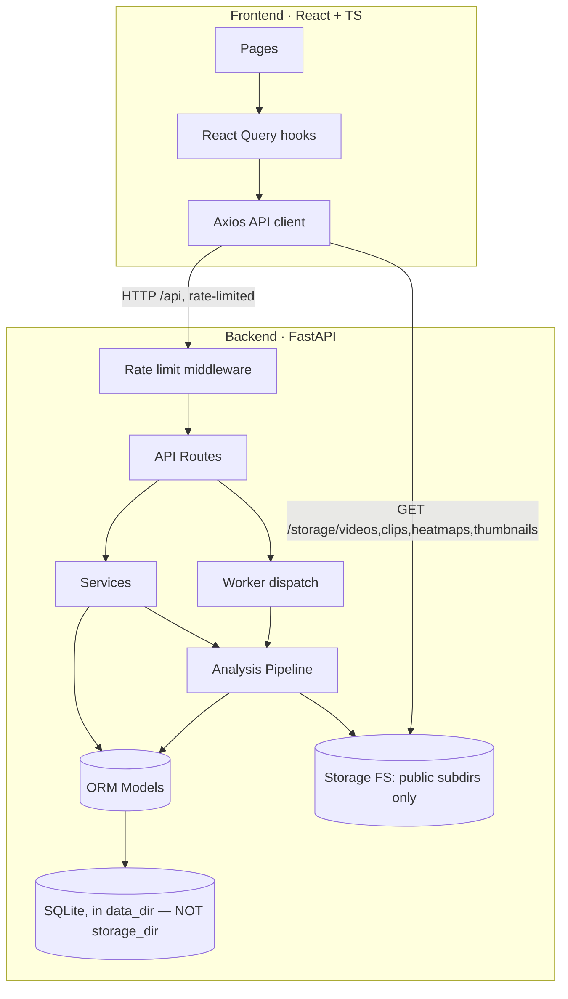
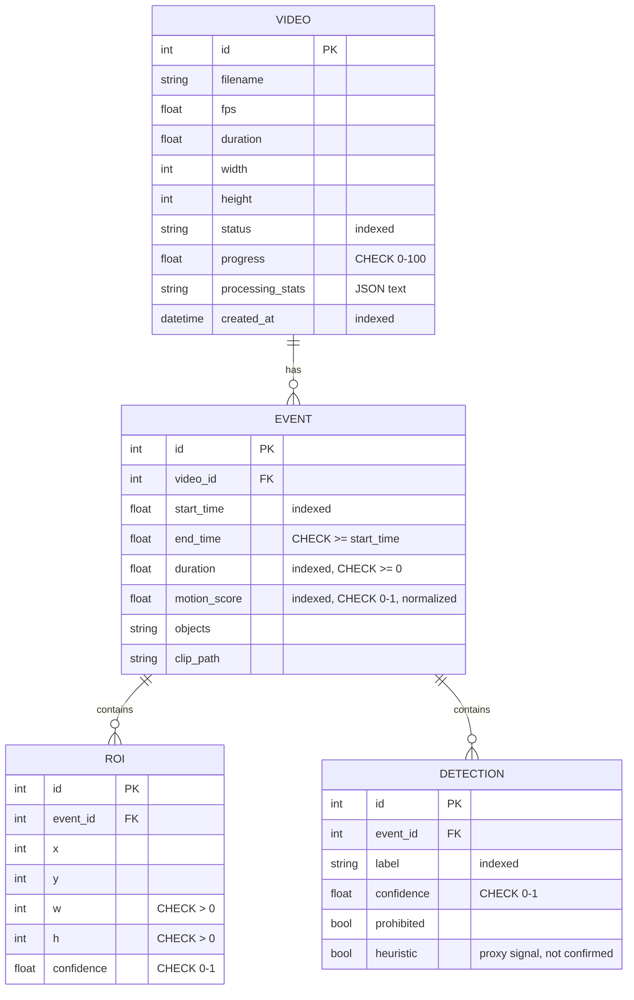

# Architecture

## Overview

A clean, layered architecture separates transport (API), orchestration
(services/pipeline), persistence (models/database) and background execution
(workers). The frontend is a decoupled SPA that talks to the backend purely
over REST. For the full rationale behind every design decision (not just
the "what"), see [`../SYSTEM_DESIGN.md`](../SYSTEM_DESIGN.md).



**Security note**: the database lives in a separate `data_dir`, never inside
`storage_dir`, and only specific named subdirectories of `storage_dir` are
mounted for static serving (`app.main.create_app()`) — never the storage
root. This was a real vulnerability in an earlier revision; see
`SYSTEM_DESIGN.md` §8.5.

## Backend layers

```
backend/app/
├── api/            HTTP layer (routes, dependencies) — thin, no business logic
│   ├── deps.py     Shared FastAPI dependencies (DB session, 404 helpers,
│   │               shared VideoDetail response mapper)
│   └── routes/     videos, analysis, events, clips, heatmap, timeline, reports
├── services/       Business logic & the AI pipeline
│   ├── motion_detection.py   MOG2 / frame-diff / optical-flow + auto-select
│   ├── roi_detection.py      Contour filtering + box merging + perf cap
│   ├── segmentation.py       Smoothing + hysteresis → activity segments
│   ├── object_detection.py   YOLOv11 wrapper: batching, caching, custom-model hooks
│   ├── heatmap.py            Motion accumulation → PNG
│   ├── pipeline.py           Orchestrates the full flow; frame-reader thread
│   ├── analytics.py          SQL-aggregated analytics + timeline
│   ├── video_service.py      Upload, metadata, CRUD, pagination, global stats
│   └── report.py             CSV + PDF export
├── models/         SQLAlchemy ORM: Video, Event, ROI, Detection (with CHECK constraints)
├── schemas/        Pydantic request/response contracts
├── database/       Engine, session factory, declarative base, SQLite FK pragma
├── workers/        Thread runner + optional Celery app
├── core/           Config (validated pydantic-settings), structured logging,
│                   rate-limiting middleware
└── utils/          geometry, video I/O, files, upload content validation
```

### Design principles

- **SOLID / single responsibility** — each service owns one concern; the
  pipeline composes them. Motion algorithms sit behind one `MotionDetector`
  interface (Strategy pattern) so they are interchangeable at runtime, with
  a fourth pseudo-mode (`auto`) resolved *before* construction via
  `select_best_algorithm()`.
- **Dependency injection** — request-scoped DB sessions and services are
  injected via FastAPI `Depends`; the shared `to_video_detail()` mapper in
  `api/deps.py` keeps every route that returns a `VideoDetail` consistent.
- **Graceful degradation everywhere** — missing FFmpeg (→ OpenCV clip
  fallback), missing YOLO weights (→ detection disabled), a handful of
  corrupt frames (→ skipped, logged, not fatal), a GPU OOM (→ falls back to
  CPU and retries), a database outage (→ 503, not a raw traceback) — none of
  these crash the pipeline or the API process.
- **Defense in depth** — security-relevant checks are layered rather than
  singular: upload validation is extension + Content-Length + streamed-size
  + magic-byte content signature; cascade delete is both ORM-explicit and
  DB-FK-enforced (SQLite `PRAGMA foreign_keys=ON`); numeric config is
  Pydantic-bounded so a bad `.env` fails at startup, not mid-analysis.
- **Type-safety** — full type hints on the backend, strict TypeScript on the
  frontend; Pydantic and TS interfaces mirror each other field-for-field.

## Data model



## The analysis pipeline

1. **Decode (single pass, background thread)** — `_FrameReaderThread`
   decodes sequentially and pushes sampled frames onto a bounded queue,
   overlapping I/O with the main thread's CV processing.
2. **Resolve algorithm** — if `auto`, pre-scan ~40 frames and heuristically
   pick MOG2 / frame-diff / optical-flow.
3. **Motion detection** — per frame, produce a noise-filtered motion score
   (Otsu-adaptive threshold, resolution-scaled morphology, connected-
   component area filter) and a binary foreground mask.
4. **ROI detection** — contours → resolution-relative area filter → merge
   overlapping boxes → cap raw-contour count for perf safety.
5. **Heatmap accumulation** — sum masks into a fixed-size float buffer
   (independent of video duration).
6. **Segmentation** — smooth the score series (moving average), apply
   hysteresis thresholding (separate enter/exit levels — prevents
   flicker-driven fragmentation), bridge short gaps, drop short segments,
   compute video-relative normalized scores.
7. **Second pass (light)** — per segment, seek ~3 representative frames:
   run batched YOLO (object detection, with perceptual-hash caching), cut
   the clip (FFmpeg, OpenCV fallback), grab a thumbnail.
8. **Persist** — write Video/Event/ROI/Detection rows, artefact paths, and
   `processing_stats` (per-stage timing/throughput telemetry).

The heavy work is one decode; the second pass only random-seeks a few frames
per segment, and per-event sample lookups use binary search
(`bisect_left`/`bisect_right`) rather than a linear scan — keeping the whole
thing tractable for multi-hour 1080p footage. See `SYSTEM_DESIGN.md` §
Performance for the specific complexity fixes made during the engineering
audit.

## Background execution

`settings.task_backend` selects how analysis runs:

- `thread` (default) — a daemon thread with its own DB session; zero external
  dependencies.
- `celery` — jobs are dispatched to a Celery worker over Redis.

Both share the exact same `run_analysis` implementation and progress
reporting. An atomic conditional `UPDATE` (`VideoService.try_mark_queued`)
guards the transition into `queued`, closing a TOCTOU race where two
near-simultaneous `POST /analyze` calls could otherwise both enqueue
analysis for the same video.

## Cross-cutting concerns

- **Rate limiting** (`core/rate_limit.py`) — in-process sliding-window
  middleware, per-route-group budgets, injectable limits for testability.
  Documented as not multi-worker-safe (see `SYSTEM_DESIGN.md`).
- **Structured logging** (`core/logging_config.py`) — text or JSON output
  (`LOG_FORMAT`), plus a `LogTimer` context manager used throughout the
  pipeline for consistent stage-timing/throughput metrics.
- **Upload validation** (`utils/validation.py`) — magic-byte container
  signature sniffing, independent of and in addition to the extension
  allow-list.
