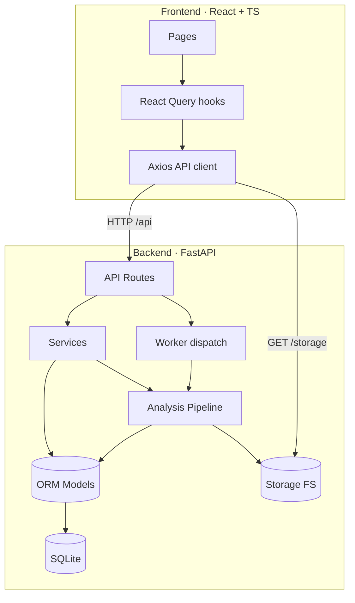
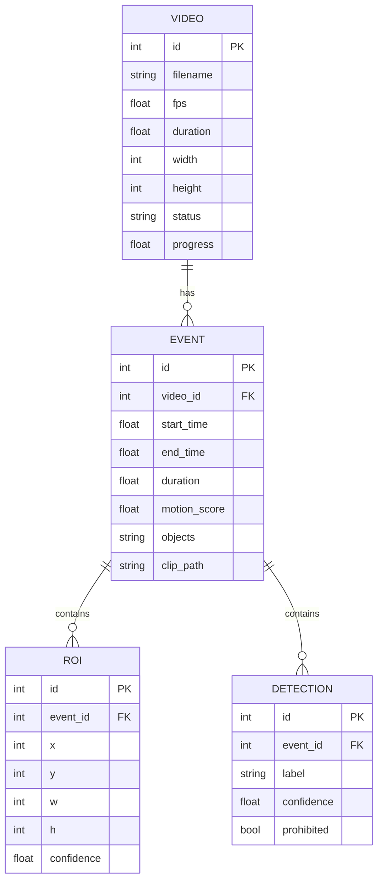

# Architecture

## Overview

A clean, layered architecture separates transport (API), orchestration
(services/pipeline), persistence (models/database) and background execution
(workers). The frontend is a decoupled SPA that talks to the backend purely
over REST.



## Backend layers

```
backend/app/
├── api/            HTTP layer (routes, dependencies) — thin, no business logic
│   ├── deps.py     Shared FastAPI dependencies (DB session, 404 helpers)
│   └── routes/     videos, analysis, events, clips, heatmap, timeline, reports
├── services/       Business logic & the AI pipeline
│   ├── motion_detection.py   MOG2 / frame-diff / optical-flow strategies
│   ├── roi_detection.py      Contour filtering + box merging
│   ├── segmentation.py       Motion timeline → activity segments
│   ├── object_detection.py   YOLOv11 wrapper (graceful fallback)
│   ├── heatmap.py            Motion accumulation → PNG
│   ├── pipeline.py           Orchestrates the full flow, persists results
│   ├── analytics.py          Read-model aggregation (analytics + timeline)
│   ├── video_service.py      Upload, metadata, CRUD
│   └── report.py             CSV + PDF export
├── models/         SQLAlchemy ORM: Video, Event, ROI, Detection
├── schemas/        Pydantic request/response contracts
├── database/       Engine, session factory, declarative base
├── workers/        Thread runner + optional Celery app
├── core/           Config (pydantic-settings) + logging
└── utils/          geometry (IoU/merge), video I/O (probe/thumbnail/clip), files
```

### Design principles

- **SOLID / single responsibility** — each service owns one concern; the
  pipeline composes them. Motion algorithms sit behind one `MotionDetector`
  interface (Strategy pattern) so they are interchangeable at runtime.
- **Dependency injection** — request-scoped DB sessions and services are
  injected via FastAPI `Depends`.
- **Graceful degradation** — missing FFmpeg (→ OpenCV clip fallback) or missing
  YOLO weights (→ detection disabled) never crash the pipeline.
- **Type-safety** — full type hints on the backend, strict TypeScript on the
  frontend; Pydantic and TS interfaces mirror each other.

## Data model



## The analysis pipeline

1. **Decode (single pass)** — iterate frames with a configurable sample step.
2. **Motion detection** — per frame, produce a normalised motion score and a
   binary foreground mask (algorithm selectable per run).
3. **Noise filtering** — morphological open/dilate on the mask.
4. **ROI detection** — contours → filter tiny areas → merge overlapping boxes.
5. **Heatmap accumulation** — sum masks into a float buffer.
6. **Segmentation** — the motion-score timeline is grouped into activity
   segments (bridge short gaps, drop short segments).
7. **Second pass (light)** — for each segment, seek to ~3 representative frames:
   run YOLO (object detection), cut the clip (FFmpeg), grab a thumbnail.
8. **Persist** — write Video/Event/ROI/Detection rows and artefact paths.

The heavy work is one decode; the second pass only random-seeks a few frames per
segment, keeping the whole thing tractable for multi-hour 1080p footage.

## Background execution

`settings.task_backend` selects how analysis runs:

- `thread` (default) — a daemon thread with its own DB session; zero external
  dependencies.
- `celery` — jobs are dispatched to a Celery worker over Redis.

Both share the exact same `run_analysis` implementation and progress reporting.
